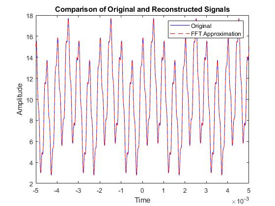
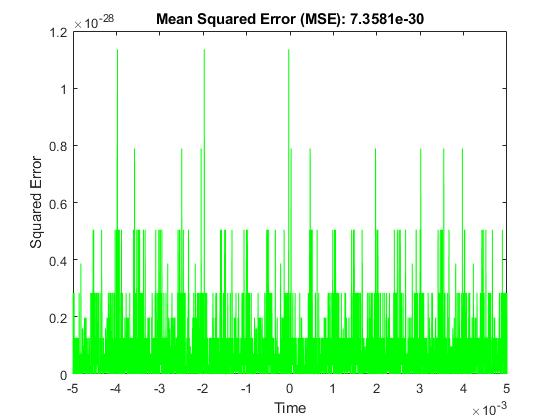

# 🔍 FFT Signal Reconstruction and Analysis


MATLAB tool for signal reconstruction using the **Fast Fourier Transform (FFT)**. Processes time-domain data from a `.txt` file, decomposes it into frequency components, reconstructs the signal using a selectable number of harmonics, and quantifies accuracy via **Mean Squared Error (MSE)**.

---

## 📊 Results

### Signal reconstruction — original vs FFT approximation



> **Original signal** (blue) vs **FFT approximation** (red).  
> Visual overlap confirms high-fidelity reconstruction across the full time window.

### Mean Squared Error



> **MSE = 7.3581 × 10⁻³⁰** — effectively zero numerical error,  
> confirming that the FFT reconstruction is virtually indistinguishable from the original signal.

---

## 🧠 Key Features

- **Automated Data Handling** — detects and transposes data columns from `.txt` inputs automatically
- **FFT Implementation** — converts time-domain signals to the frequency domain using MATLAB's `fft`
- **Selectable harmonics** — user defines N at runtime; more harmonics = higher fidelity
- **Error Analysis** — quantifies reconstruction accuracy with MSE
- **Coefficient Table** — outputs Fourier coefficients (aₙ and bₙ) in structured format
- **Visualization** — side-by-side comparison plot + squared error plot

---

## ⚙️ Mathematical Background

Any periodic signal x(t) can be approximated by a Fourier Series:

$$
x(t) \approx \frac{a_0}{2} + \sum_{n=1}^{N} \left[ a_n \cos(2\pi n f_0 t) + b_n \sin(2\pi n f_0 t) \right]
$$

Where:
- **N** = number of harmonics selected by the user
- **aₙ, bₙ** = Fourier coefficients derived from the FFT output

Reconstruction accuracy is validated by the **Mean Squared Error (MSE)**:

$$
MSE = \frac{1}{M} \sum_{i=1}^{M} \left( x_{\text{original}}[i] - x_{\text{reconstructed}}[i] \right)^2
$$

For `curve1.txt` with N harmonics, the result was **MSE = 7.3581 × 10⁻³⁰**, confirming near-perfect reconstruction.

---

## 🧩 Folder Structure

```text
Signal-Analyzer/
├── Signal Samples/
│   ├── curve1.txt           # Primary test signal
│   └── noisy_data.txt       # Optional noisy signal
├── images/
│   ├── Reconstruction.jpg   # Comparison plot: original vs FFT
│   └── MSE.jpg              # Squared error over time
├── analog_2_continuos.m     # Main MATLAB processing script
└── README.md
```

---

## 🚀 How to Use

### Prerequisites

- MATLAB R2020a or newer
- Input signal file (`.txt`) placed inside `Signal Samples/`

### Input File Format

Two whitespace-separated columns:

```
0.000  0.125
0.001  0.150
0.002  0.100
```

| Column | Description |
|--------|-------------|
| 1 | Time (t) |
| 2 | Amplitude (A) |

### Execution

```bash
git clone https://github.com/VoIkmer/Signal_Analyzer.git
```

1. Open MATLAB and navigate to the project folder
2. Run:
   ```matlab
   analog_2_continuos
   ```
3. Select your `.txt` file when prompted
4. Enter the number of harmonics N

---

## 📈 Output & Analysis

| Output | Description |
|--------|-------------|
| Reconstruction plot | Original (black) vs FFT approximation (red dashed) |
| MSE plot | Squared error at each time step |
| Coefficient table | aₙ and bₙ values for each harmonic |
| MSE value | Printed in the plot title and command window |

> **Note on Gibbs phenomenon:** near signal discontinuities, increasing N may introduce overshoot. This is a known theoretical property of Fourier reconstruction, not a script error.

---

## 🧑‍💻 Author

**Carlos Eduardo**  
Electrical Engineering Student — UFBA

- Email: cguimaraesbarbosa03@gmail.com
- GitHub: [VoIkmer](https://github.com/VoIkmer)
- LinkedIn: [carl0sedu](https://www.linkedin.com/in/carl0sedu/)

---

## 📚 License

MIT License — free to use, modify, and distribute.
